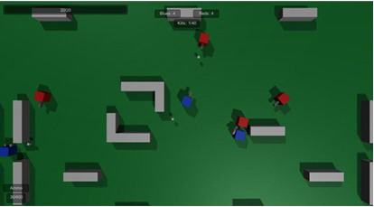

# DATASAKURA
Тестовое задание компании DATASAKURA.

## ТЗ:

Zoo World - это 3D игра, где вы можете увидеть разных животных. 

### Камера: 

Вид сверху. 

### Графика: 

Графика не требуется. Можно использовать коробки, сферы и другие простые примитивы. Вы свободно можете использовать любые ассеты из магазинов или других ресурсов, но это не повлияет на итоговый результат. 

### Игровой процесс: 

Каждые 1-2 секунды появляется одно животное и начинает двигаться хаотично. Животные могут сталкиваться друг с другом физически. 

Если животное выходит за пределы экрана, оно меняет направление движения для возвращения на экран. 

### Цепочка питания 

#### Жертвы 

Если жертва сталкивается с другим животным-жертвой, они просто отскакивают друг от друга. Если жертва сталкивается с хищником, она погибает и исчезает с экрана. 

#### Хищники 

Если хищник сталкивается с другими животными (жертвами или другими хищниками), он их поедает. Если два хищника сталкиваются между собой, один из них выживает, а другой погибает (вы можете выбрать самый простой способ реализации этого). Каждый раз, когда хищник ест другое животное, под ним должна появиться надпись "Вкусно!".

### Животные 

#### Лягушка 

Лягушка является животным-жертвой. Её движение - это прыжки. Каждые X секунд она делает прыжок на фиксированное расстояние. 

#### Змея 

Змея - это хищник. Она движется линейно (фиксированная дистанция в секунду). 

### Интерфейс 

В верхнем правом углу должен быть счетчик погибших животных-жертв и хищников. Интерфейс должен быть создан с помощью uGUI. 

### Что мы хотим достичь с этим тестовым заданием: 

Главное, на что мы обращаем внимание - это архитектура животных. Мы ожидаем увидеть четкую, легко расширяемую и понятную кодовую базу. Предположим, что в ближайшем будущем мы добавим 1000 различных животных (птиц, пауков, рыб, крабов и т.д.). Мы также следим за использованными ассетами. Если вы знакомы с внедрением зависимостей (DI) или другими фреймворками, лучше включить их. Если у вас есть опыт работы с архитектурными паттернами, пожалуйста, покажите нам.

# Реализация

## Фишки

- Для физического передвижения животных используется (Rigidbody).
- uGUI применяется для интерфейса (счетчик смертей).
- Префабы обеспечивают разделение сущностей, что ведет к минимизации конфликтов паралельной разработки с использованием Git.
- База данных (DataBase) на ScriptableObject это единое хранение ресурсов без предвариательной загрузки в память, ссылочный структурированный доступ обеспечивает экономию ресурсов при поиске данных.
- Данные приложения хранятся в GameData, предполагается структура LevelData (временные данные игры), PlayerData (сохраняемые между сессиями данные), AccauntData и т.д.. 
- Реализован DI Zenject через ProjectInstaller (глобальные зависимости) и SceneInstaller (зависимости сцены).
- При создании зверей показана работа с фабрикой животных AnimalFactory.
- Для надписей "Вкусно" создан независимый пулл объектов, создающийся при запуске сцены (SceneInstaller) и доступный через Zenject.
- Объектно-ориентированное программирование с использованием интерфейсов, абстрактных классов и событий.
- Корутины (SpawnTimer) для асинхронного спавна животных. 

## Архитектурные паттерны

Проект использует несколько паттернов для обеспечения модульности и расширяемости:

**Strategy (Стратегия)**:

- Применяется в IMovementStrategy для разделения логики движения (JumpMovement для лягушки, LinearMovement для змеи).
- Позволяет легко добавлять новые типы движения без изменения базового класса Animal.

**Factory (Фабрика)**:

- AnimalFactory создает экземпляры животных (Frog, Snake) на основе имен префабов из DataBase.
- Использует DI для инстанцирования, поддерживая случайные позиции и повороты.

**Object Pool (Пул объектов)**:

- ObjectPool<TextDelicious> управляет текстом "Вкусно!", минимизируя создание/уничтожение объектов.
- Реализован с интерфейсом IPoolableObject для гибкости и абстрактный класс PoolableObject для базовой реализации получения и возврата объектов.

**Observer (Наблюдатель)**:

- События OnVictimDeath и OnPredatorDeath в GameData.LevelData уведомляют UI об изменениях счетчиков.

**Dependency Injection (DI)**:

- Zenject связывает компоненты (GameManager, LevelController, UIManager) без жестких зависимостей.

## Преимущества подхода

**Расширяемость:**

- Добавление нового животного требует лишь создания класса (наследника Animal), настройки движения и префаба в DataBase. Архитектура готова к масштабированию до 1000 типов животных, как указано в ТЗ.

**Модульность:**

- Логика разделена: движение (IMovementStrategy), создание (AnimalFactory), управление (LevelController), UI (UIManager).
- Изменение одной части не затрагивает другие.

**Производительность:**

- Пул объектов снижает нагрузку на сборщик мусора при частом отображении текста "Вкусно!".
- Использование событий минимизирует прямые вызовы методов.

**Тестируемость:**

- DI упрощает замену зависимостей на заглушки для тестов.
- Интерфейсы (IAnimal, IMovementStrategy) позволяют изолировать логику.

**Читаемость:**

- Код структурирован по принципу единственной ответственности, с комментариями и логичными именами.

## Итог:

